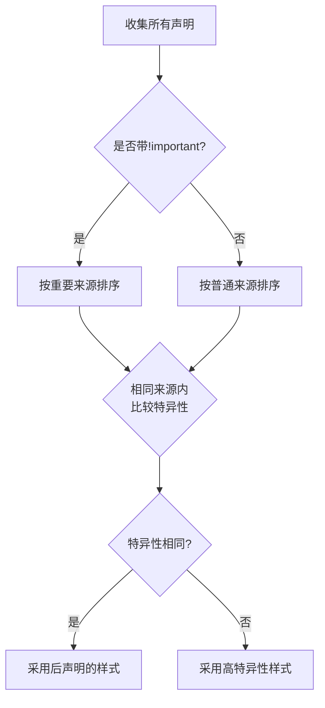

# CSS层叠规则

## CSS Cascade 层叠规则详解

层叠（Cascade）是CSS的核心机制，用于解决多个样式规则同时应用于同一元素时的冲突问题。它通过一套明确的规则确定最终应用的样式值。

### 层叠处理的三大要素

层叠规则按照以下优先级顺序进行判断（1 > 2 > 3）：

1. **来源与重要性（Origin & Importance）**
2. **选择器特异性（Selector Specificity）**
3. **源代码顺序（Source Order）**

---

### 来源与重要性（最高优先级）
"**来源与重要性**"是 CSS 层叠规则中最高优先级的判定因素，它决定了不同来源的样式声明之间的优先关系。这个规则的核心在于两个维度：样式来源和 **!important** 标志。

#### 1. 样式来源的三个层级
CSS 样式有三种不同的来源，按优先级从低到高排列：


>💡 `!important` 会改变来源的优先级：用户的重要样式 > 作者的重要样式 > 普通样式

#### 2. `!important` 使用示例
```css
.button {
background: blue !important; /* 重要规则 */
}

#special-button {
background: red; /* 普通规则 */
}
```
即使 `#special-button` 特异性更高，带有 `!important` 的规则仍优先应用。

---

### 三、选择器特异性（中等优先级）

当来源相同时，通过选择器特异性判断优先级。

#### 1. 特异性计算规则（由高到低）
* **内联样式**：`style="..."`（特异性得分 1-0-0-0）
  * **ID选择器**：`#header`（每个ID得 0-1-0-0）
    * **类/属性/伪类**：`.btn`, `[type="text"]`, `:hover`（每项得 0-0-1-0）
      * **元素/伪元素**：`div`, `::before`（每项得 0-0-0-1）

#### 2. 特异性比较原则
- 从左向右逐级比较：`1-0-0-0` > `0-2-0-0`
- 不进位：`0-1-12-3` < `0-2-0-0`
- 通配符(`*`)、组合符(`>`, `+`)、`:not()` 不影响特异性（但`:not()`内部的选择器计入）

#### 3. 特异性示例
| 选择器              | 特异性值  | 计算说明              |
| ------------------- | --------- | --------------------- |
| `style="color:red"` | (1,0,0,0) | 内联样式              |
| `#nav .active a`    | (0,1,2,1) | 1个ID + 2个类 + 1元素 |
| `ul#menu li.item`   | (0,1,1,2) | 1个ID + 1个类 + 2元素 |
| `.btn:hover`        | (0,0,2,0) | 2个伪类               |
| `div p`             | (0,0,0,2) | 2个元素               |

---

### 四、源代码顺序（最终决胜规则）

当来源和特异性均相同时，**后声明的规则覆盖先声明的规则**。

```css
/* 最终生效：绿色 */
.alert { color: red; }
.alert { color: green; }

/* 最终生效：第二个按钮 - 橙色 */
.button.primary { background: blue; }
[class="button primary"] { background: orange; } /* 特异性相同，后声明胜出 */
```

---

### 五、特殊规则与注意事项

1. **继承的样式**：
- 继承的样式优先级最低（低于所有直接样式）
- 显式设置 `inherit` 值会按正常规则计算

2. **`@layer` 级联层规则**：
```css
@layer base, theme;

@layer theme {
.title { color: red; }
}

@layer base {
.title { color: blue; } /* 最终生效：蓝色 */
}
```
- 层顺序优先于源代码顺序
- 未分层样式 > 分层样式

3. **应避免的做法**：
- 过度使用 `!important`（难以覆盖）
- 滥用ID选择器（特异性过高）
- 超长选择器链（降低可维护性）

---

### 六、层叠判定流程图



---

### 总结：层叠规则应用口诀

> 一判来源重要性，
> 二看选择特异性，
> 最后顺序定输赢，
> 级联图层需留意！

通过理解层叠规则，开发者可以：
- 精准控制样式优先级
- 避免不必要的 `!important`
- 编写可维护的CSS代码
- 高效解决样式冲突问题
