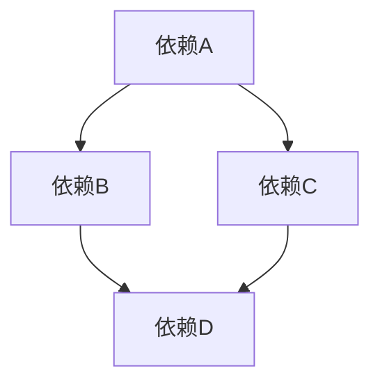
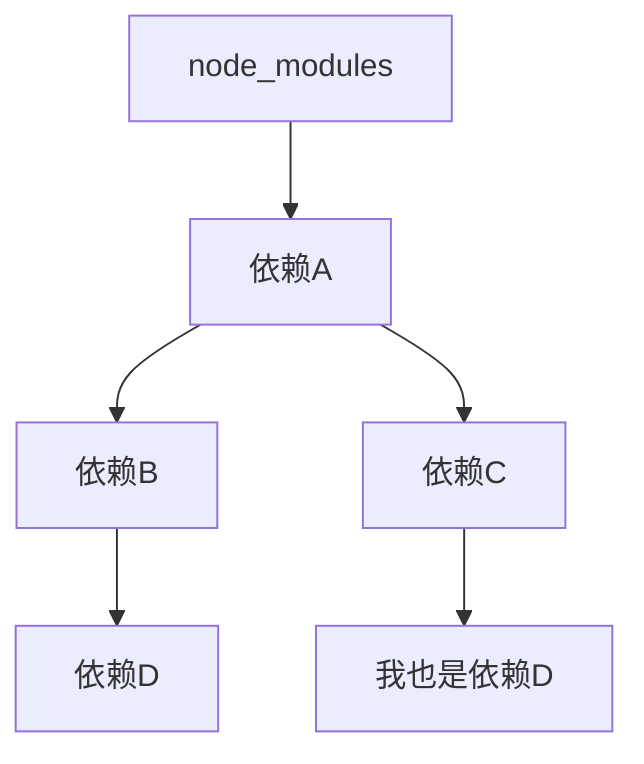
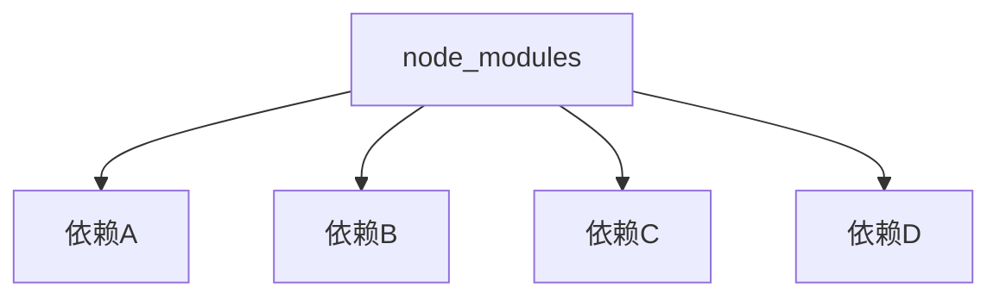

# pnpm和npm

## npm和pnpm是什么？
- `npm（Node Package Manager）`是 Node.js 的默认包管理器，也是全球最大的软件注册表。自 2010 年发布以来，它已成为 JavaScript 生态系统的基础设施，负责依赖安装、版本管理和包发布。

- `pnpm（Performant npm）`是一个替代性的包管理器，于 2017 年推出。它完全兼容 npm 的工作流程和注册表，但在底层实现上采用了创新的存储和链接策略，旨在解决 npm 的性能、磁盘空间和依赖管理问题。

两者都能执行相同的基本任务：安装依赖、管理版本、运行脚本，但它们在实现细节上存在根本性差异。


### 幽灵依赖问题
又叫幻影依赖，意思是：

我们工程中，一般会在package.json里声明很多依赖，比如：
```json
{
  "dependencies": {
    "vue": "^3.0.0",
    "axios": "^0.21.1"
  }
}
```

当我们安装后，会在`node_modules`目录下发现很多依赖，但是很多是并没有在package.json中声明的依赖，这些就是间接依赖。

这会导致一些问题，比如你**居然可以在js里导入这些间接依赖！**，尽管它们并没有在package.json中声明。

**这就是幻影依赖问题。**

这至少会导致如下问题：
- 版本问题。假设你有包A，有一个间接依赖包B，你升级了包A，那包B很有可能也跟着一起升级，而此时如果你有幻影依赖问题直接调用了这个包B，那很可能就会发生无法预测的报错
- 依赖丢失问题。假设开发阶段有开发依赖包A，而你幻影依赖调用了间接依赖包B，在生产环境下，很可能不会安装开发依赖，直接安装正常依赖，那包B就不存在了，生产环境就会报错。


本质原因是，**依赖是一个图结构**，安装过后，会变成一个文件结构，也就是**树结构**，而这两种结构是不兼容的。

正常的依赖图是这样：

而文件树是这样：

随着工程规模扩大，文件树重复的依赖会越来越多，这会导致磁盘空间浪费。

后来，npm借鉴了yarn的做法，为了解决磁盘占用的问题，它把依赖目录直接拍扁，变成了这样：

**这就造成了我们上面所提到的，幻影依赖问题。**


## npm的原理（v3+）
1. **依赖解析**
npm 会先把 package.json 中声明的「语义化版本范围」与 registry 返回的可用版本做 **semver 计算**，生成一张完整的「依赖图（DAG）」。

2. **拍平算法（hoist）**
从 DAG → 文件树时，npm 采用「尽可能提升」策略：
- 只要版本兼容，就把包提升到最靠近根 node_modules 的位置。
- 若同一包出现不兼容版本，则在对应子包里再建一层 node_modules。
结果看上去是「几乎拍平」的结构，也因此让「幻影依赖」有了可乘之机——代码可以 require/import 到**并未被声明**的兄弟包。

3. 物理存储
每个包都是完整复制（full copy）。
如果 10 个项目都用 lodash@4.17.21，磁盘上就会出现 10 份实体文件；缓存仅用于「下载」阶段，安装时依旧解包到各自目录。

4. 缓存策略
npm 会把下载的 tarball 放进 `~~~/.npm/_cacache~~`（Windows 在 %AppData%/npm-cache）。
第二次安装时若命中缓存可省去网络，但**解压 & 复制**动作仍然一个不少，因此 I/O 时间依旧长。

## pnpm的原理(相对于npm的改进)
1. **内容寻址存储（CAS，Content-Addressable Store）**
所有下载过的包按 **tarball 的 sha512** 命名，统一放在**全局 store**（默认 `~/.pnpm-store`）。
同一版本永远只有一份实体，100 个项目共用也不额外占磁盘。

2. **非扁平结构 + 硬链接/符号链接**
pnpm 放弃 hoist，而是：
- 在 `node_modules/.pnpm/` 里按 `<name>@<version>/node_modules/<name>` 的物理嵌套方式存放真实文件。
- 在项目的 `node_modules` 根目录只放**直接依赖**的**符号链接**（win 为 junction，其余为软链）。
目录树示意：
```md
node_modules
├─ .pnpm
│  ├─ lodash@4.17.21/node_modules/lodash  ← 全局 store 的硬链接
│  └─ vue@3.2.45/node_modules/vue
├─ lodash -> ./.pnpm/lodash@4.17.21/node_modules/lodash   ← 符号链接
└─ vue   -> ./.pnpm/vue@3.2.45/node_modules/vue
```
3. 严格依赖隔离
因为只有直接依赖出现在根 node_modules，子包若想用别人的依赖必须**显式声明**；幻影依赖自然消失。
4. 快速解析与安装
解析阶段与 npm 相同，但生成的是**嵌套地址表**而非拍平表。
安装阶段只做「硬链接」或「符号链接」，**几乎 0 复制**；大项目秒装。

::: warning 这里再详细说明一下
:::
**硬链接 · 符号链接 · 软链接 是什么？**
1. **硬链接（Hard Link）**

- 只在同一文件系统内有效（不能跨盘 / 跨分区）。
- 多个目录项指向 同一个 inode（文件实体）。
- 删除任意一个入口，文件实体不会消失，直到所有硬链接数为 0。
- 对程序完全透明，看起来像独立文件，stat 大小相同。
- 不能对目录做硬链接（Linux/Unix 限制，防止循环）。
- pnpm 在 *nix 系统把全局 store 里的真实文件硬链接到 `node_modules/.pnpm/...`，所以几乎不占额外磁盘。

2. **符号链接 = 软链接（Symbolic Link / Soft Link）**

非常像“快捷方式”

- 是一个特殊文件，内容保存的是“目标路径”。
- 可以跨文件系统，也能指向目录。
- 删除源文件，链接就“悬空”（dangling）。
- 读取软链时，操作系统自动帮你跳转到目标；程序如果用的是 readlink 才能看到链接本身。
- Windows 下 pnpm 会优先用 Directory Junction（目录连接，一种受限但性能好的软链）指向目录；文件级再用软链。


## Lockfile对比
| 项目     | npm (package-lock.json)                      | pnpm (pnpm-lock.yaml)                       |
| -------- | -------------------------------------------- | ------------------------------------------- |
| 结构     | 巨大 JSON，含元数据 & 包本体 hash            | 精简 YAML，只记录解析结果                   |
| 快照粒度 | 每个包字段多（integrity、dev/optional 标志） | 只记录 id、解析后路径、hash                 |
| 跨平台   | 会重写 lock（Windows 再装一次经常变）        | 路径用 Posix 风格，**同一 lock 全平台通用** |
| 合并冲突 | 大 JSON 极易冲突                             | YAML 行少，冲突概率低                       |
| 安装速度 | 需二次解析 + 校验                            | 直接按 lock 路径做链接，跳过解析            |

> 结论：pnpm-lock.yaml 更小、更稳定、合并更友好。

## 如何迁移
1. 清理旧依赖
```bash
# 项目根执行
rm -rf node_modules package-lock.json
# 有 monorepo 的顺手删子包 lock
find . -name package-lock.json -delete
```

2. 全局装 pnpm
```bash
npm i -g pnpm   # 官方推荐 corepack 方式：corepack enable 
```

3. 一键重装
```bash
pnpm install
```
- 第一次会建立全局 store，冷装也比 npm 快。

- 如果出现“找不到包”错误，99 % 是**幻影依赖**被暴露——把缺的包补进 package.json 即可（这是好事）。

4. 脚本 & CI 适配
- 把 npm run xxx 换成 pnpm xxx。
- CI 缓存目录改一下：
```yaml
# GitHub Actions 示例
- name: Cache pnpm store
  uses: actions/cache@v3
  with:
    path: ~/.pnpm-store
    key: ${{ runner.os }}-pnpm-${{ hashFiles('**/pnpm-lock.yaml') }}
```
5. 常见踩坑速查
| 现象                  | 原因                      | 解决                                              |
| --------------------- | ------------------------- | ------------------------------------------------- |
| `ERROR_EROFS`         | 全局 store 建在只读盘     | 设 `STORE_PATH` 到可写目录                        |
| Windows 长路径报错    | 软链深度 + 长包名 > 260   | 1. 启用 Win10 长路径策略 2. 用 `--hoist` 临时规避 |
| Docker 镜像体积没减小 | 把 `~/.pnpm-store` 打进去 | 多阶段构建，只拷项目文件，pnpm fetch 在线装       |

6. 回退方案
若线上仍需 npm，只要保留 `package.json` 就能随时 `rm pnpm-lock.yaml && npm i`回滚，零成本逃生。

## Monorepo 支持
Monorepo 支持 = **把多个“可独立发布”的包/应用** 放在 **同一个 Git 仓库** 里统一管理，而 pnpm 让你：

1. 一键安装 **整个仓库** 的依赖（只拉一次、磁盘 0 重复）；  
2. 内部代码互相引用时 **不用发 npm 包**，直接写 `workspace:*` 就能实时同步；  
3. 按 **依赖拓扑** 批量执行脚本（先 build 底层，再 build 上层）；  
4. 只发布真正变动的子包，CI 速度秒级。

---

### 直观例子（无 Monorepo 时）

```text
repo-a/                 repo-b/                 repo-c/
├─ package.json         ├─ package.json         ├─ package.json
└─ src                  └─ src                  └─ src
```

- 每个仓库自己 `npm i`，`lodash` 被重复下载 3 份。  
- 如果 `repo-a` 想引用 `repo-b` 的工具函数，必须先 **把 b 发到 npm**，再回来 `npm install @my/b` → 调试一次发一次，麻不麻？

---

### 用 pnpm Monorepo 以后

```text
my-docs/                        ← 单 Git 仓库
├─ pnpm-workspace.yaml
├─ packages/
│  ├─ shared/                   ← 公共工具包
│  │  └─ package.json
│  ├─ docs-vitepress/           ← 文档站点
│  │  └─ package.json
│  └─ utils/                    ← 自定义工具函数
│     └─ package.json
└─ apps/
   ├─ chrome-extension/         ← Chrome 插件
   └─ cli/                      ← 命令行工具
```

**pnpm-workspace.yaml** 只要两行：

```yaml
packages:
  - 'packages/*'
  - 'apps/*'
```

---

### 日常工作流（pnpm 帮你做的事）

| 命令                               | 效果                                                                                            |
| ---------------------------------- | ----------------------------------------------------------------------------------------------- |
| `pnpm install`                     | **一次性**把根 + 所有子包依赖装好，重复包硬链接到全局 store，磁盘只存 1 份。                    |
| `pnpm --filter @my/shared build`   | 仅构建 `shared` 包。                                                                            |
| `pnpm -r run build`                | 按 **依赖拓扑** 自动排序，先 build `shared`，再 build 依赖它的 `docs-vitepress`、`cli` …        |
| `pnpm --filter docs-vitepress dev` | 在文档站点里实时调试，代码里直接 `import { util } from '@my/shared'`，**免发布、免 npm link**。 |
| `pnpm changeset`                   | 生成变更集，CI 自动帮你 **bump 版本 + 发包**，只发有变动的子包。                                |

---

### 一句话总结
Monorepo 支持 = **“一个仓库里养 N 个包”** 时，pnpm 让你  
装依赖更快、内部互相引用更爽、批量脚本执行更智能，  
还自带 **workspace 协议** 和 **changeset 工作流**，  
从此告别“发一次 npm 调一次代码”的轮回。