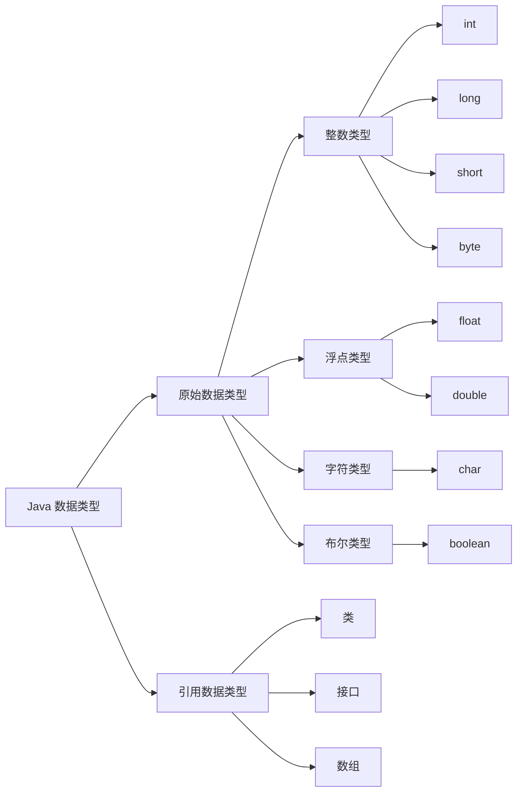
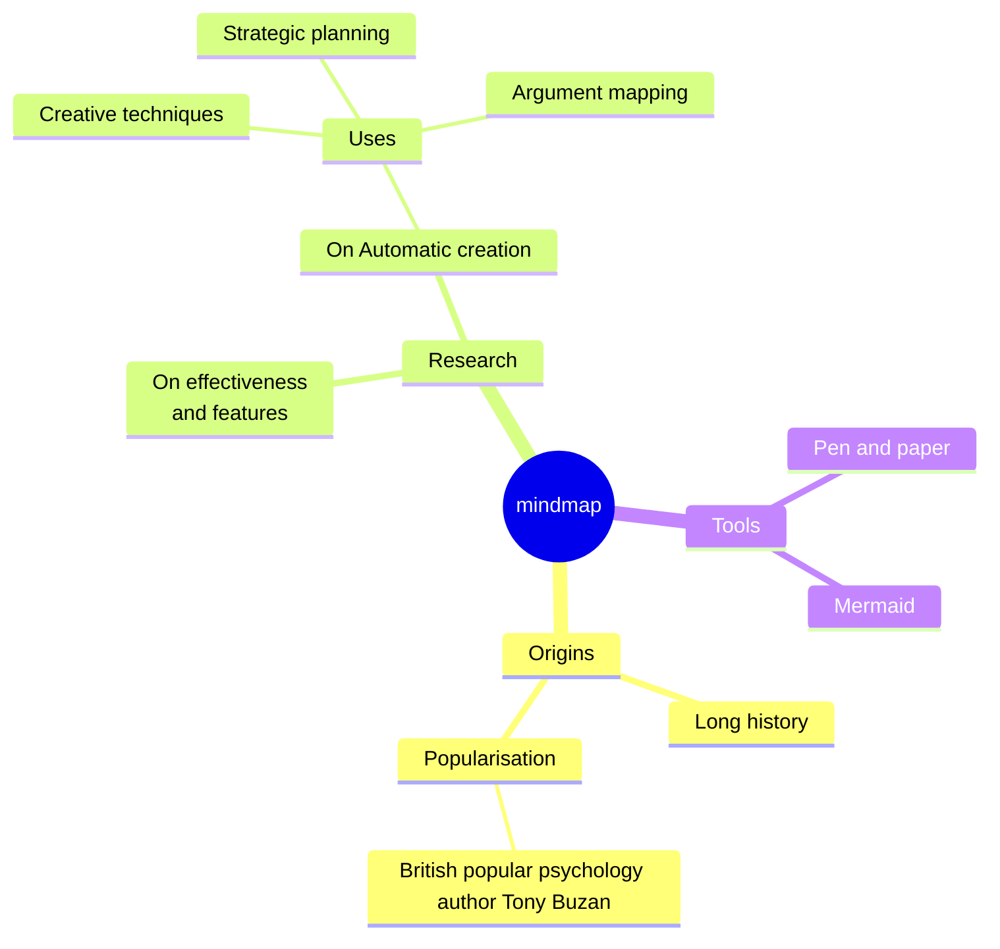

# 插件
记录一些有意思的插件的使用

## 时间线
使用的是[@HanochMa/vitepress-markdown-timeline](https://github.com/HanochMa/vitepress-markdown-timeline)的项目
可以查看他[使用的效果](https://hanochma.github.io/daily/2023-04)

::: CTcode 安装
```sh
pnpm install vitepress-markdown-timeline
```
:::

::: CTcode 引入
在`.vitepress/config.ts`中先注册 markdown 解析插件
```js
// .vitepress/config.ts or .vitepress/config.js
import timeline from "vitepress-markdown-timeline";
export default {
  // ...
  markdown: {
    // ...
    config: (md) => {
      md.use(timeline);
    },
  },
};
```
在`.vitepress/theme/index.ts`中引入时间线样式
```js{7}
// .vitepress/theme/index.ts or .vitepress/theme/index.js
import Theme from "vitepress/theme";
import "./styles/vars.scss";
import "./styles/style.scss";

// 只需添加以下一行代码，引入时间线样式
import "vitepress-markdown-timeline/dist/theme/index.css";

export default {
  ...Theme,
  enhanceApp(ctx) {
    Theme.enhanceApp(ctx);
  },
};
```
:::

::: CTcode 使用
在markdown文件中以`::: timeline 时间`开头，`:::`结尾，中间插入内容即可（内容中可使用任何markdown语法）
```md
    ::: timeline(防生效) 2023-05-24
    - **do some thing1**
    - do some thing2
    :::
```
:::


## iconify开源图标集
你可以指定`@iconify-json/{prefix}`依赖项（其中“`{prefix}`”是图标集前缀）来仅安装你想要使用的图标集
比如：
```sh
pnpm add -D @iconify-json/tabler
```
至于具体收录的图标集，你可以查看[官方的列表](https://github.com/iconify/icon-sets/blob/master/collections.md)
你也可以[在这直接查找](https://icon-sets.iconify.design/tabler/)

你也可以选择添加所有开源图标集，即添加`@iconify / json`作为开发依赖项：
```sh
pnpm add -D @iconify/json
```
::: tip
如果你使用了`Tailwind CSS V4`，你需要添加@iconify/tailwind4作为开发依赖项：
```sh
pnpm add -D @iconify/tailwind4
```
详细可参考[官方文档](https://iconify.design/docs/usage/css/tailwind/tailwind4/)
:::

有必要，可以安装[markdown-it-container第三方插件](https://github.com/markdown-it/markdown-it-container)
用于为`markdown-it`的markdown 解析器创建块级自定义容器的插件

```sh
pnpm add -D markdown-it-container
```
如果你想将两者结合起来使用，你可以参考[将markdown-it-container插件与iconify集成至vitepress](./mic与iconify集成.md)

::: tip 小知识
VitePress官方默认使用的图标库是iconify的[simple-icons图标集](https://icon-sets.iconify.design/simple-icons/)
默认的社交链接组件使用的图标就是这个图标集的图标，组件内是通过api地址拼接config设置里的图标名来获取图标的
:::


## 引入naive-ui组件库
还是看看[naive-ui](https://www.naiveui.com/zh-CN/os-theme/docs/vite-ssge)吧

## 引入代码演示块
[ruabick](https://github.com/dewfall123/ruabick)

`ruabick`是一个vue组件库开发工具，类似dumi，基于VitePress。它可以帮助你在编写文档的时候增加一些`Vue`示例。

以下来自[ruabick文档原话](https://dewfall123.github.io/ruabick/guide/)

`VitePress` 很轻量很快，但是在写组件文档的场景下有以下不足之处:

- 1.文档和 Demo 得重复写两遍。
  > 参考 [dumi 的 demo 理念](https://d.umijs.org/)
- 2.文档，Demo 和源码在不同的目录，联系感不强。
  > 源码和 Demo 一般在`src`目录下面，但是 VitePress 通常需要新建一个docs目录，它们之间应该放在同一个地方。 参考[dumi 的目录结构](https://d.umijs.org/)
- 3.需要自动生成组件 API 文档功能。
  > 基于vue-docgen-api自动生成 api 文档（参考[arco-design-vue](https://github.com/arco-design/arco-design-vue/tree/main/packages/arco-vue-scripts)的代码）

### 安装
安装插件
```sh
pnpm add @ruabick/md-demo-plugins -D
```
```sh
pnpm add @ruabick/vitepress-demo-block -D
```

### 配置
::: CTcode 追加markdown插件
```js
// .vitepress/config.js
import { applyPlugins } from '@ruabick/md-demo-plugins';

export default defineConfig({
  markdown: {
    config: (md) => {
      applyPlugins(md);
    },
  },
});
```
:::

::: CTcode 注册demo组件
```ts
// docs/.vitepress/theme/index.ts
import DemoBlock from '@ruabick/vitepress-demo-block';
import '@ruabick/vitepress-demo-block/dist/style.css';

export default {
  ...DefaultTheme,
  enhanceApp({ app, router, siteData }) {
    app.component('demo', DemoBlock);
  },
};
```
:::

### 使用
在Markdown文档中：
```md
<demo src="../demo.vue" title="Demo block" desc="use demo"></demo>
```
也可以这样使用(去掉反斜杠)
```md
\```vue:demo
<script lang="ts" setup>
  const number = 1;
</script>

<template>
  <span>The number is {{number}}</span>
</template>
\```
```
使用时会在对应文档同目录下生成一个dist文件夹，里面就是自动生成的演示文件。

## mermaid支持
[mermaid](https://github.com/mermaid-js/mermaid) 是一个开源的图表库，以类似于 Markdown 的方式从文本生成流程图或序列图等图表。

### 安装依赖

我们需要添加个插件[vitepress-plugin-mermaid](https://github.com/emersonbottero/vitepress-plugin-mermaid)让vitepress支持mermaid使用

::: code-group
```sh pnpm
pnpm add -D vitepress-plugin-mermaid
```
```sh
npm i -D vitepress-plugin-mermaid
```
:::

如果报错，请加装mermaid本体：
::: code-group
```sh pnpm
pnpm add -D mermaid
```
```sh
npm i -D mermaid
```
:::

### 配置

安装完依赖，接着加入以下配置：
```ts
import { MermaidMarkdown, MermaidPlugin } from 'vitepress-plugin-mermaid';

export default defineConfig({

  markdown: {
    config(md) {
      md.use(MermaidMarkdown); 
    },
  },
  vite: {
    plugins: [MermaidPlugin()],
    optimizeDeps: {
      include: ['mermaid'],
    },
    ssr: {
      noExternal: ['mermaid'],
    },
  },

});
```

### 使用演示
以下只展示部分使用，更多使用请查看[mermaid官方文档](https://github.com/mermaid-js/mermaid)和[vitepress-plugin-mermaid](https://emersonbottero.github.io/vitepress-plugin-mermaid/guide/more-examples.html)

::: warning 必须的格式
想使用mermaid，必须将mermaid的代码放在` ```mermaid `中
:::

**流程图(从左到右LR)**

输入：
````

````
输出：


**更大的流程图**

输入：
````

````
输出：


思维导图：

输入：

````

````

输出：

