# 搭建vitepress

## 前言

vitepress是一个基于vue3的静态网站生成器，它的设计目标是提供一个简单、易用的方式来构建和发布文档网站。

之所以搭建这个是因为想自己记录学习过程，也方便自己查阅。

## 创建项目

开始搭建，本次搭建用的编辑器是Trae，可以使用AI辅助开发。
开发时可以打开vitepress官网查看参考文档：
[VitePress官方文档](https://vitepress.dev/zh/reference/site-config)

参考了B站的视频：[https://www.bilibili.com/video/BV1XW4y1w7bc]

### 安装vitepress

```
pnpm add -D vitepress
```

### 初始化Vitepress

```
pnpm vitepress init
```

接下来进入命令行引导

- 第一个是在当前根目录下创建项目
- 是站点标题和描述
- 主题，建议Default + Customization(自定义CSS)
- 是否使用TS,这里我们初学可以先不选，这里选no
- 是否添加脚本到packege.json，这里选yes，相当于把启动命令`pnpm docs:dev`和那些打包命令添加到package.json中
  初始化完毕后，会得到最初的项目文件夹结构，这里简单介绍下：
  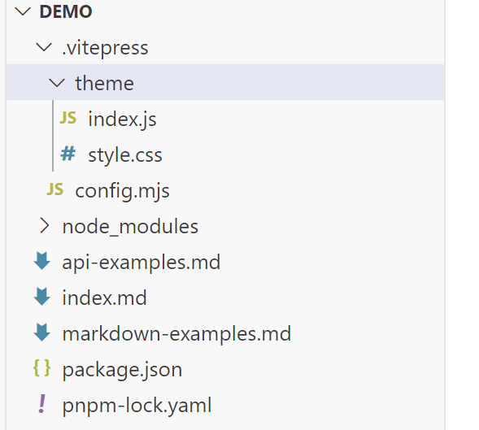
- `.vitepress` 核心目录，包含各种配置
  - `theme` 主题目录，包含各种样式，关于样式的配置在此修改
  - `utils` 工具目录，放一些工具函数，例如自动化侧边栏生成
  - `config.mjs` 核心配置文件，配置各种导航栏、标题之类的
- `index.md` 项目默认主页（这里注意，后续在添加路由文件夹读取md文件时，文件夹下至少需要一个默认index.md文件，这也是为什么项目默认生成一个）
- `package.json`和`pnpm-lock.yml` 项目配置文件、包管理工具
- `api-examples.md`和`markdown-examples.md` 官方给的两个示例

### 启动项目

```
pnpm docs:dev
```

打开，看到这个页面，说明项目初始化成功了。
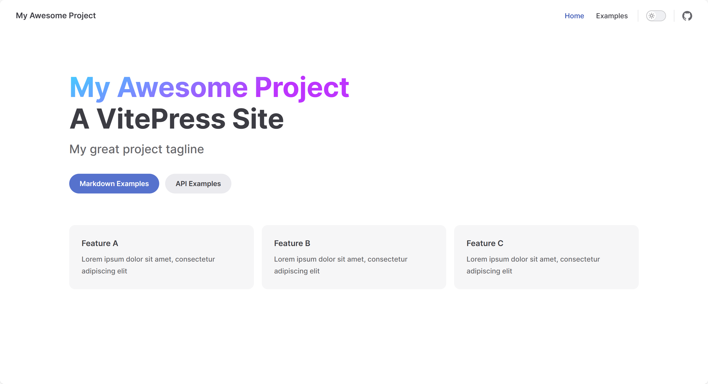

## 自定义配置

### 主页修改

对于主页，我们可以修改很多，下面是我改完的初版：
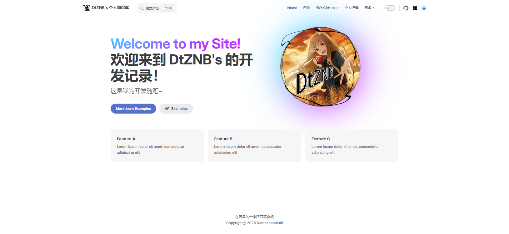
下面来逐步说明(我直接用别人的图吧):
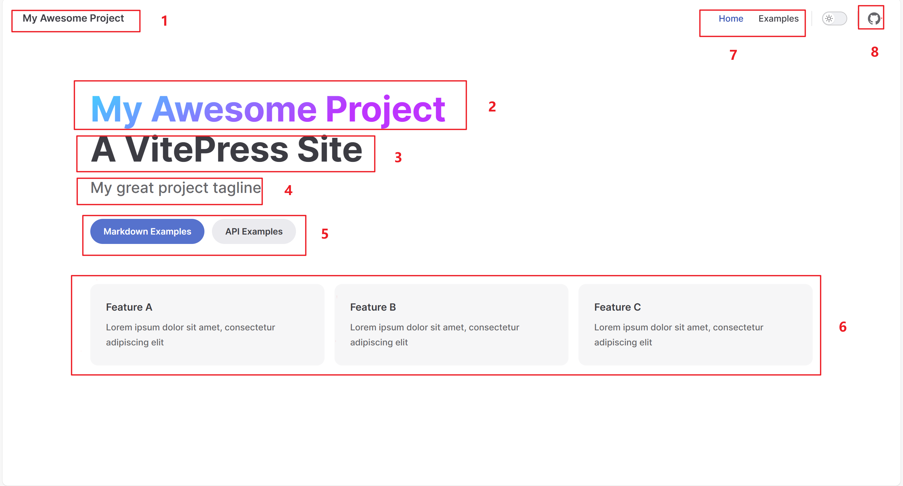
先看看是在哪配置的，让我们打开`.vitepress`文件夹下的`config.mjs`文件。
看到`defineConfig`下`themeConfig`里边，这里都是配置主题路由内容啥的。

> #### **导航栏修改**

- 首先是`1`的部分，也就是`siteTitle`，这里是左上角的默认站点标题
  `siteTitle: "DtZNB's 个人知识库",`
  我直接引用官方表述吧：
  `可以自定义此项以替换导航中的默认站点标题 (应用配置中的 title)。当设置为 false 时，导航中的标题将被禁用。这在当 logo 已经包含站点标题文本时很有用。`
  [图片示例：站点标题配置](./assets/站点标题配置.png)

- 然后是`7`的部分，这里是导航项`nav`，同样是在`themeConfig`中配置
  [图片示例：导航项配置](./assets/导航栏配置.png)
  <details>

  ```
  nav: [
        { text: "Home", link: "/" },
        { text: "示例", link: "/markdown-examples" },
        { text: "我的GitHub", link: "https://github.com/Dantezhenniubi" },
        { text: "个人记录", link: "/DailyRecord/" },
        {
          text: "更多",
          /* 这里是嵌套菜单，下同 */
          items: [
            {
              text: "个人博客",
              items: [
                { text: "关于我", link: "/about" },
                { text: "留言板", link: "/message" },
                { text: "友情链接", link: "/friend" },
              ],
            },
            { text: "两边栏演示", link: "/两边栏演示" },
            { text: "关于我", link: "/about" },
            { text: "留言板", link: "/message" },
            { text: "友情链接", link: "/friend" },
          ],
        },
      ],
  ```

  </details>

- 然后是`8`的部分，这里是社交链接`socialLinks`，同样是在`themeConfig`中配置
  可以定义此选项以在导航栏中展示带有图标的社交帐户链接。
  <details>

  ```
  export default {
    themeConfig: {
      socialLinks: [
        { icon: 'github', link: 'https://github.com/vuejs/vitepress' },
        { icon: 'twitter', link: '...' },
        // 可以通过将 SVG 作为字符串传递来添加自定义图标：
        {
          icon: {
            svg: '<svg role="img" viewBox="0 0 24 24" xmlns="http://www.w3.org/2000/svg"><title>Dribbble</title><path d="M12...6.38z"/></svg>'
          },
          link: '...',
          // 也可以为无障碍添加一个自定义标签 (可选但推荐):
          ariaLabel: 'cool link'
        }
      ]
    }
  }
  ```

  </details>

- 网站导航栏还可以配置站点标题前的Logo，同样是在`themeConfig`中配置，需要增加一项`logo`
  `logo: "/Logo.svg", // 导航栏logo`
  [图片示例：Logo配置](./assets/站点标题Logo.png)

> **显然，网站导航栏不止上面提到的站点标题、Logo、导航项、社交链接，还要有搜索栏**

- 搜索栏配置也是在`themeConfig`中配置，需要增加一项`search`
  [图片示例：搜索栏配置](./assets/主页搜索框.png)
  <details>

  ```
  // 搜索配置
    search: {
      provider: "local",
      options: {
        translations: {
          button: {
            buttonText: "搜索文档",
            buttonAriaLabel: "搜索文档",
          },
          modal: {
            noResultsText: "无法找到相关结果",
            resetButtonTitle: "清除查询条件",
            footer: {
              selectText: "选择",
              navigateText: "切换",
              closeText: "取消",
            }
          }
        }
      }
    },
  ```

  </details>

> #### **标签页修改**

- 可以修改标签页的标题，在`defineConfig`下新增一项`title`
  [图片示例：标签页标题](./assets/标签页标题.png)
  `title: "Welcome to my Site!",`

> **⚠️注意⚠️**：上面不属于页面内容，而是站点通用，所以是在config.mjs中修改的。至于为什么放在主页修改这一章，是因为一般只有主页浏览时特别关注这部分。
> 下面这些才是页面内容的修改。

### **主页内容修改**

既然是主页，也算是一个页面，自然是单独一个文件，所以我们需要在项目下默认的`index.md`中修改。

> 如图所示:[图片示例:主页布局总结](./assets/主页布局总结.png)

- 来看`1`的部分，这里是大标题`title`
  **[图片示例：主页大标题](./assets/主页大标题.png)**
  在这个`index.md`文件中，我们可以修改大标题hero的配置
  **[图片示例：主页大标题代码](./assets/主页大标题代码.png)**
  `title: "Welcome to my Site!",`

- 其它部分同理，教程就不一一赘述了，简单总结介绍下对应关系：
  `1 => name => 大标题`
  `2 => text => 大标题下的描述`
  `3 => tagline => 小标题`
  `4 => actions => 标题下的按钮`
  `5 => features => 列表`
  `6 => image => 图片`
  `7 => footer => 页脚`
  需要说明的是，对于4的按钮，是可以跳转的，link指定路径，比如/api-example就是在项目根目录下找api-example.md这个文件

### 侧边栏配置

侧边栏配置也是在`config.mjs`中修改的，需要增加一项`sidebar`

- 在`themeConfig`下新增一项`sidebar`即`sidebar: {},`
- 在`sidebar`下新增一项`"/": [],`，这里的`"/"`是路由路径，`[]`是路由下的内容
- **意思就是说，指定该路由路径下的页面才会显示该侧边栏**
  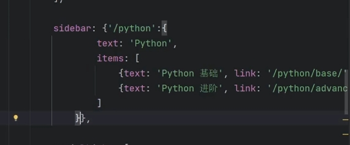
  如果你像我一样写了一个自动侧边栏的js，那么你可以直接这样使用：

```
    sidebar: {
      "/DailyRecord/index": set_sidebar("/DailyRecord"),

    },
```

- 如果说你想要分小章节，你可以像这样子编写，这样只会在各自的页面显示小章节页面：
  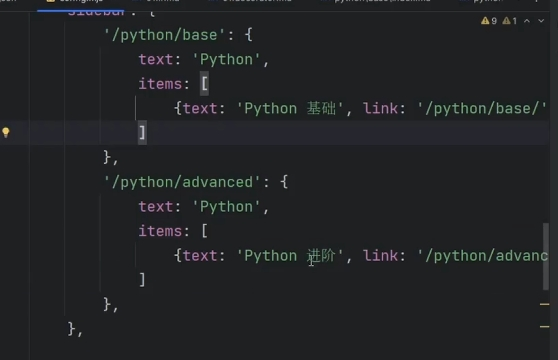
- 如果你还想要更高级一点的写法，你可以像这样写：
  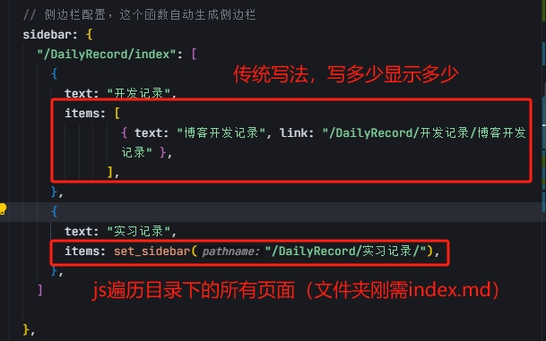
  这里使用了自定义的自动侧边栏js函数，原理其实较简单，遍历传入目录下所有文件路径，图中上部分是传统的写法，下部分是使用我自己写的自动侧边栏js函数的写法
  **值得注意的是，作为大目录的文件夹需要index.md文件否则会报错，其它正常的md文件则作为正常的页面显示。**
  注意：如果你传的路由是"/"，那么就会把项目目录下所有的页面都显示侧边栏, 这个是官方示例，对初学者有一定误导性。

### 文章页面配置

目前初版的文章页面改成了这样:
[图片示例：文章页面](./assets/文章页面.png)
那么我们想要像图中这样的话，首先就要把默认的侧边栏关闭，然后把文章导航移动至左侧(后面我发现其实可以指定路由页面显示侧边栏，不用默认全部关闭)
在`config.mjs`中的`themeConfig`下添加如下配置内容：

```
sidebar: false, // 关闭侧边栏
aside: "left", // 设置右侧文章导航左侧显示
```

- 显然这样还是不够的，我们还要修改页面的样式来填补空缺
- 我们找到项目下theme文件夹下的`style.css`文件
- 可以通过查看浏览器工具F12里来找到vitepress默认的样式，然后根据需要覆盖样式内容
- 在`style.css`文件中添加如下内容：
  <details>

  ```
  .DocSearch {
    --docsearch-primary-color: var(--vp-c-brand-1) !important;
  }

  /* 自定义侧边栏在最左边，右边撑满宽度 */
  .VPDoc .container {
    margin: 0 !important;
    /* 移除容器外边距 */
  }

  @media (min-width: 960px) {
    .VPDoc:not(.has-sidebar) .content {
      max-width: 100% !important;
      /* 没有侧边栏时的内容最大宽度 */
    }
  }

  .VPDoc.has-aside .content-container {
    max-width: 1488px !important;
    /* 有侧边栏时的内容容器最大宽度 */
  }

  @media (min-width: 960px) {
    .VPDoc:not(.has-sidebar) .container {
      display: flex !important;
      justify-content: center !important;
      /* max-width: 2880px !important; */
      max-width: none !important; /* 移除最大宽度限制 */
      /* 没有侧边栏时的容器最大宽度 */
    }
  }

  .aside-container {
    position: fixed;
    top: 0;
    padding-top: calc(var(--vp-nav-height) + var(--vp-layout-top-height, 0px) + var(--vp-doc-top-height, 0px) + 10px) !important;
    /* 左侧边栏上部内边距 */
    /* width: calc(100% - 224px) !important; */
    width: 224px;
    height: 100vh;
    overflow-x: hidden;
    overflow-y: auto;
    scrollbar-width: none;
  }

  /* 自定义h2的间距 */
  .vp-doc h2 {
    margin: 0px 0 16px;
    padding-top: 24px;
    border: none;
  }
  /* 自定义h2的前缀 */
  .vp-doc h2::before {
    content: "💡";
  }


  /* 侧边栏标题 */
  .aside-content .outline-title {
    margin: 10px 0 10px;
    font-size: 1.5rem;
    font-weight: 1500;
    color: var(--vp-c-text-2);
    position: relative;
  }
  /* 侧边栏标题后缀 */
  .aside-content .outline-title::after {
    content: "～(∠・ω<)⌒✨";
    font-size: 0.9rem;
    font-weight: 1500;
    color: var(--vp-c-text-2);
    margin-left: 10px;
    position: absolute;
  }
  /* 侧边栏内容块 */
  .aside-content {
    /* font-style: italic; */
    font-size: 3.9rem;
    color: var(--vp-c-text-2);
    padding: 0px 0px;
    border-radius: 6px;
    transition: all 0.25s ease;
    margin-bottom: 4px;
  }
  /* 激活的侧边栏项样式 */
  .aside-content .active {
    color: var(--vp-c-brand-1);
    background-color: var(--vp-c-brand-soft);
    padding: 8px 22px;
    font-weight: bolder;
    /* box-shadow: aqua 0px 6px 10px; */
  }
  /* 侧边栏hover效果 */
  .aside-content:hover {
    background-color: var(--vp-c-bg-soft);
    color: var(--vp-c-text-1);
    transform: translateX(4px);
  }


  /* 侧边栏link文字 */
  .aside-content .outline-link {
    font-style: normal !important;
    font-size: 0.9rem;
    padding-left: 26px;
  }
  /* 侧边栏link块 */
  .aside-content a {
    color: inherit;
    display: block;
    position: relative;
    padding: 0px 22px;  /* 增加上下内边距 */
    margin: 4px 0;  /* 增加外边距 */
    font-size: 1rem !important; /* 调大字体 */
  }
  /* 侧边栏link前缀常态 */
  .aside-content a::before {
    content: "•";
    position: absolute;
    left: 0;
    color: var(--vp-c-brand-1) !important;
  }
  /* 侧边栏link前缀激活后 */
  .aside-content .active::before {
    content: "👉";
    position: absolute;
    left: 0;
    color: var(--vp-c-brand-1) !important;

  }
  /* 侧边栏link选中后 */
  .aside-content a:hover {
    color: var(--vp-c-brand-1) !important;
  }


  /* 标记 */
  .aside-content .outline-marker {
    padding-left: 10px;
    padding-bottom: 30px;
    padding-top: 22px;
  }
  ```

  </details>

- 这样，我们就得到了图中的效果了。

### 文章侧面标题导航栏

在文章页面的左侧，我们可以看到一个导航栏，这个导航栏是根据文章的标题来生成的，我们可以通过修改`config.mjs`中的`themeConfig`下的`outline`来配置
比如下面这种写法，意思就是默认显示H2-H4标题：

```
outline: [2, 4], // 文章左侧导航栏显示层级
```

当然我们可以默认关闭：

```
outline: false, // 关闭文章左侧导航栏
```

你还可以修改导航的位置，比如左侧还是右侧：

```
outline: "left", // 文章左侧导航栏
```

如果想更灵活一些，比如指定哪些页面，那么你可以直接到该页面的md文件中的frontmatter中添加`outline: false`来关闭该页面的导航栏, 其它同理。

> 为什么设置outline: false关闭之后，还会残留有一块区域？

这是因为在VitePress中，`outline: false`和`aside`属性是两个不同的配置项，它们共同控制页面右侧区域的显示：

1. `outline: false` - 仅关闭了大纲内容的显示（即页面目录），但并不会移除右侧区域本身
2. `aside: "right"` - 控制侧边栏的位置，设置为`right`表示将侧边栏放在右侧
   即使关闭了大纲显示，由于`aside`属性仍然设置为`right`，所以右侧区域仍然保留，只是没有内容显示。想完全移除右侧区域，则需要设置**`aside: false`**

详情参考：https://vitepress.dev/zh/guide/markdown
https://vitepress.dev/zh/reference/frontmatter-config

## 自动化工具

### 自动化侧边栏

在前面的学习中，我们知道，我们使用这种配置时常常是一个目录有很多md文件，这些md文件所在的目录对应导航栏的一个选项。侧边栏的配置需要自己手写一个个路由映射到相应的文件上，那么有没有一个自动生成侧边栏的工具呢？根据一个目录下面的所有md文件自动生成路由，可以使用下面这个脚本：

- 在项目根目录创建一个`utils`文件夹
- 在`utils`文件夹下创建一个`auto_sidebar.mjs`文件
- 在`auto_sidebar.mjs`文件中编写如下代码，自动生成侧边栏
  <details>

  ```
        import path from "node:path"
        // 引入path模块, 用于处理文件路径, 例如获取文件名, 扩展名等
        import fs from "node:fs"
        // 引入fs模块, 用于处理文件系统, 例如读取文件, 写入文件等

        // 自动处理路由
        // 文件根目录
        const DIR_PATH = path.resolve();
        // 白名单，过滤不是文章的文件和文件夹
        const WHITE_LIST = [
            "index.md",
            ".vitepress",
            "node_modules",
            ".idea",
            "assets",
        ];

        // 判断是否是文件夹
        const isDirectory = (path) => {
            return fs.lstatSync(path).isDirectory();
        };

        // 取差值
        // const intersections = (arr1, arr2) =>
        //     Array.from(new Set(
        //         arr1.filter((item) => !new Set(arr2).has(item))));
        // 优化为
        // 取差集（在arr1中但不在arr2中的元素）
        const getDifference = (arr1, arr2) => {
            // 对于小型数组，直接使用filter和includes即可
            if (arr2.length < 10) {
                return arr1.filter(item => !arr2.includes(item));
            }

            // 对于较大的数组，使用Set提高查找效率
            const set2 = new Set(arr2);
            return arr1.filter(item => !set2.has(item));
        };

        // 方法导出直接使用
        // function geList(params, path1, pathname) {
        //    // 存放结果
        //    const res = [];
        //    // 开始遍历params
        //    for (let file in params) {
        //      // 拼接目录
        //      const dir = path.join(path1, params[file]);
        //      // 判断是否是文件夹
        //      const isDir = isDirectory(dir);
        //      if(isDir) {
        //        // 如果是文件夹，读取之后作为下一次递归参数
        //        const files = fs.readdirSync(dir);  // readdirSync() 方法用于返回指定目录的文件和子目录的数组。
        //        res.push({
        //          text: params[file], // 文件夹名称
        //          collapsible: true, // 可折叠
        //          items: geList(files, dir, `${pathname}/${params[file]}`)
        //          // 递归调用，获取子目录下的文件夹和文件
        //        });
        //      } else {
        //        // 获取文件扩展名
        //        // 第一种
        //        const suffix = path.extname(params[file]);
        //        if (suffix !== ".md") {
        //          // 不是md文件，跳过
        //          continue;
        //        }
        //        // 直接获取不含扩展名的文件名
        //        const name = path.basename(params[file], suffix);

        //        // 添加到结果数组
        //        res.push({
        //          text: name,
        //          link: `${pathname}/${name}`
        //        });
        //      }
        //    }
        //    return res;
        // }

        function geList(params, path1, pathname) {
          // 存放结果
          const res = [];
          // 开始遍历params (改用for...of循环)
          for (const item of params) {
            // 拼接目录
            const dir = path.join(path1, item);
            // 判断是否是文件夹
            const isDir = isDirectory(dir);
            if (isDir) {
              // 如果是文件夹，读取之后作为下一次递归参数
              const files = fs.readdirSync(dir); // readdirSync() 方法用于返回指定目录的文件和子目录的数组。
              res.push({
                text: item, // 文件夹名称
                collapsible: true, // 可折叠
                items: geList(files, dir, `${pathname}/${item}`),
                // 递归调用，获取子目录下的文件夹和文件
              });
            } else {
              // 获取文件扩展名
              const suffix = path.extname(item);
              if (suffix !== ".md") {
                // 不是md文件，跳过
                continue;
              }
              // 直接获取不含扩展名的文件名
              const name = path.basename(item, suffix);

              // 添加到结果数组
              res.push({
                text: name,
                link: `${pathname}/${name}`,
              });
            }
          }
          return res;
        }

        export const set_sidebar = (pathname) => {
          // 获取pathname的路径
          const dirPath = path.join(DIR_PATH, pathname);
          // 读取pathname下的所有文件和文件夹
          const files = fs.readdirSync(dirPath); // readdirSync() 方法用于返回指定目录的文件和子目录的数组。
          // 过滤掉白名单以外的文件和文件夹
          const filterItems = getDifference(files, WHITE_LIST);
          return geList(filterItems, dirPath, pathname);
        }

  ```

  </details>

- 然后在`config.mjs`文件中引入`auto_sidebar.mjs`文件
  `import { set_sidebar } from "./utils/auto_sidebar.mjs";`
- 在`config.mjs`文件中修改`themeConfig`下的`sidebar`配置
  如：`sidebar: set_sidebar("DailyRecord"),`
  下面是修改好的例子：
  <details>

  ```
  sidebar: {
      "/DailyRecord/": set_sidebar("/DailyRecord"),
      "/": [
        {
          text: "官方示例",
          collapsed: true,
          items: [
            { text: "Markdown示例", link: "/markdown-examples" },
            { text: "Runtime API示", link: "/api-examples" },
          ],
        },
      ],
    },
  ```

  </details>

### 半自动化列表

前面的学习中我们知道，每个路由文件夹下至少需要一个默认index.md文件，那么这个文件显示的内容如果可以自动列出文件夹下的所有md文件就好了，初步的方案是像下述这样的半自动方式：

- 在文件夹下创建一个index.md文件
- 在同一个文件夹下创建一个update_index.mjs文件
- 在update_index.mjs文件中编写如下代码，自动生成列表
  <details>

  ```
        // 运行自动更新DailyRecord/index.md文件，列出该目录下所有md文件
        import fs from 'fs';
        import path from 'path';
        import { fileURLToPath } from 'url';

        // 获取当前文件的路径
        const __filename = fileURLToPath(import.meta.url);
        const __dirname = path.dirname(__filename);

        // 文件夹路径 - 使用当前文件所在目录
        const dirPath = __dirname;

        // 读取文件夹下的所有文件
        function getMarkdownFiles(dirPath) {
          const files = fs.readdirSync(dirPath);

          // 过滤出.md文件，并排除index.md
          return files.filter(file => {
            return file.endsWith('.md') && file !== 'index.md';
          });
        }

        // 生成markdown列表
        function generateMarkdownList(files) {
          return files.map(file => {
            // 获取不含扩展名的文件名作为显示文本
            const name = path.basename(file, '.md');
            return `- [${name}](./${file})`;
          }).join('\n');
        }

        // 更新index.md文件
        function updateIndexFile() {
          const files = getMarkdownFiles(dirPath);
          const listContent = generateMarkdownList(files);

          // 构建新的文件内容
          const content = `# 开发日志

        ### 三级标题
        ### 三级标题2
        #### 四级标题

        这里记录了我的日常开发和学习记录。

        ## 记录列表

        ${listContent}`;

          // 写入文件
          fs.writeFileSync(path.join(dirPath, 'index.md'), content);
          console.log('index.md 已更新');
        }

        // 执行更新
        updateIndexFile();
  ```

  </details>

- 在当前文件夹打开终端，运行`node update_index.mjs`, 即可自动生成列表。
  鉴于本人目前学识浅薄，暂不做自动化研究，后续有时间再研究。

> ## 部署

### 在Github上部署

- 首先，将项目上传至Github仓库，这里我是手动先创了一个`.gitignore`文件(忽略列表)，然后命令行上传的，后面我用SourceTree再关联了一遍远程仓库，其实可以直接用SourceTree创建远程仓库直接上传的。
- 在仓库点击`Settings`，然后点击`Pages`，在`Build and deployment`的`Source`中选择`Github Actions`
  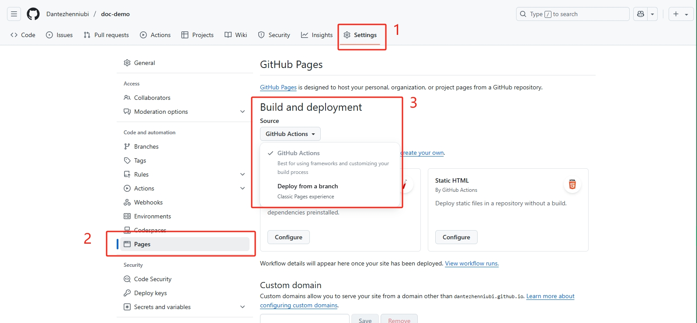

- 设置工作流。去到`Actions`中，点击设置自己的工作流
  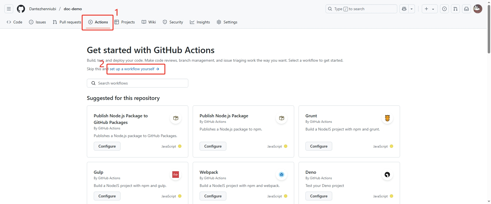
- 来到编写界面，输入以下配置内容（这里我参考了Vitepress官方文档，再根据自己的项目使用的各类版本进行修改）
  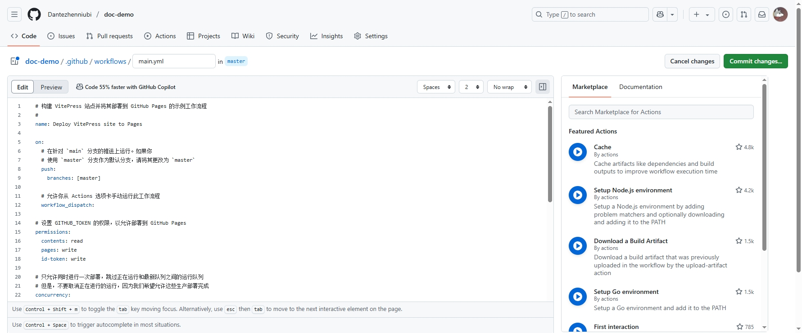

  **配置内容如下:**
  <details>
    
  ```
    # 构建 VitePress 站点并将其部署到 GitHub Pages 的示例工作流程
    #
    name: Deploy VitePress site to Pages

  on: # 在针对 `main` 分支的推送上运行。如果你 # 使用 `master` 分支作为默认分支，请将其更改为 `master`
  push:
  branches: [master]

      # 允许你从 Actions 选项卡手动运行此工作流程
      workflow_dispatch:

  # 设置 GITHUB_TOKEN 的权限，以允许部署到 GitHub Pages

  permissions:
  contents: read
  pages: write
  id-token: write

  # 只允许同时进行一次部署，跳过正在运行和最新队列之间的运行队列

  # 但是，不要取消正在进行的运行，因为我们希望允许这些生产部署完成

  concurrency:
  group: pages
  cancel-in-progress: false

  jobs: # 构建工作
  build:
  runs-on: ubuntu-latest
  steps: - name: Checkout
  uses: actions/checkout@v4
  with:
  fetch-depth: 0 # 如果未启用 lastUpdated，则不需要 - name: Setup pnpm
  uses: pnpm/action-setup@v3 # 使用pnpm官方Action
  with:
  version: 10.6.5 # 指定pnpm版本 - name: Setup Node
  uses: actions/setup-node@v4
  with:
  node-version: 20.18.2 # 指定与本地相同的Node.js版本
  cache: pnpm # 使用pnpm缓存 - name: Setup Pages
  uses: actions/configure-pages@v4 # 在工作流程自动配置GithubPages - name: Install dependencies
  run: pnpm install - name: Build with VitePress
  run: pnpm run docs:build # 启动项目 - name: Create .nojekyll file
  run: touch .vitepress/dist/.nojekyll # 创建.nojekyll文件防止GitHub Pages使用Jekyll处理 - name: Upload artifact
  uses: actions/upload-pages-artifact@v3
  with:
  path: .vitepress/dist

      # 部署工作
      deploy:
        environment:
          name: github-pages
          url: ${{ steps.deployment.outputs.page_url }}
        needs: build  # 在build后面完成
        runs-on: ubuntu-latest  # 使用最新的Ubuntu运行器
        name: Deploy
        steps:
          - name: Deploy to GitHub Pages
            id: deployment  # 部署步骤的ID
            uses: actions/deploy-pages@v4  # 使用GitHub Pages部署操作

  ```
  </details>

  ```

- 在GitHub Pages部署中， .nojekyll 文件是一个特殊的空文件，它的作用是告诉GitHub Pages不要使用Jekyll处理你的网站。

> **为什么需要这个文件？**

1. 默认行为 ：GitHub Pages默认会使用Jekyll（GitHub自己的静态站点生成器）来处理上传的文件
2. 问题 ：Jekyll处理时会忽略以下划线 \_ 开头的文件和目录，而VitePress和许多现代前端框架生成的静态文件中可能包含这类文件（如 .vitepress/dist/\_assets/ ）
3. 解决方案 ：添加 .nojekyll 文件可以防止Jekyll处理，确保所有文件都能被正确部署和访问
4. 在工作流配置中， touch .nojekyll 命令会在构建目录中创建一个空的 .nojekyll 文件。这个文件会被上传到GitHub Pages，告诉GitHub不要使用Jekyll处理这个站点。

- 然后我们继续，在上方更改命名为`deploy.yml`，然后点击右上角`Commit changes`提交(默认就行), 然后等待部署完成即可。

> 若出错，删除本地.git文件夹和远端仓库，重新上传仓库.
> 以下是需要注意的点：

1. workflow配置文件

- 查看workflow配置文件中pnpm和node版本是否一致，可以在本地使用命令`pnpm -v`和`node -v`查看。
- 部署时，需要将`workflow`配置文件中的`name`改为`deploy`，否则会报错。

2. 推送时使用的PAT或SSH

   > ### **PAT（Personal Access Token）简单介绍**
   >
   > 优点：
   - 配置简单，适合在 CI/CD、第三方工具、命令行等多种场景下使用。
   - 可以细粒度设置权限（如只读、只写、workflow等），安全性高。
   - 支持 HTTPS，适合不方便配置 SSH 的环境。

   缺点：
   - 需要妥善保管 Token，一旦泄露有安全风险。
   - Token 有有效期，需要定期更新。
   - 每次推送涉及敏感操作（如 workflow 文件）时，必须确保 Token 权限足够。

   > ### **SSH简单介绍**
   >
   > 优点：
   - 安全性高，基于公私钥加密，密钥不易被暴力破解。
   - 一次配置后长期有效，无需频繁输入密码或更新。
   - 适合频繁操作和自动化脚本。

   缺点：
   - 初次配置相对繁琐，需要生成密钥并添加到 GitHub。
   - 某些受限环境（如部分 CI/CD 平台）配置 SSH 可能不如 PAT 灵活。

   总结：
   - 日常开发推荐 SSH，自动化和细粒度权限控制推荐 PAT。两者都很安全，选择哪种方式主要看你的使用场景和便利性需求。

   > ### 遇到问题？

   #### 权限问题

   如果你出现类似报错：

   ```
   ! [remote rejected] master -> master (refusing to allow an OAuth App to create or update workflow `.github/workflows/deploy.yml` without `workflow` scope)
   ```

   说明你当前使用的 **Git 认证方式**（如 OAuth App Token）**没有 workflow 权限**，GitHub 出于安全考虑， **不允许没有 workflow 权限的 Token 修改或上传** .github/workflows/ 目录下的文件 。

   > 解决方法：
   1. 使用具有 workflow 权限的 Personal Access Token (PAT):
      - 登录 GitHub 账号，进入 Settings -> Developer settings -> Personal access tokens
      - 点击 Generate new token
      - 选择对所有库操作
        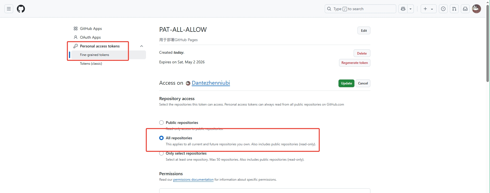
      - 找到仓库权限部分，设置workflow权限为`Read and write`, 其它必要的权限例如`Repo`也记得设置好，还有设置过期时间`No expiration`是永久有效的意思，不过不建议。
        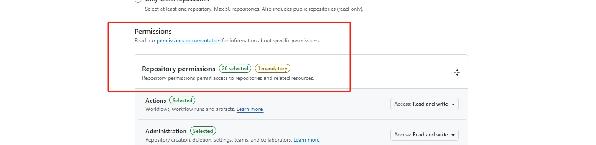
        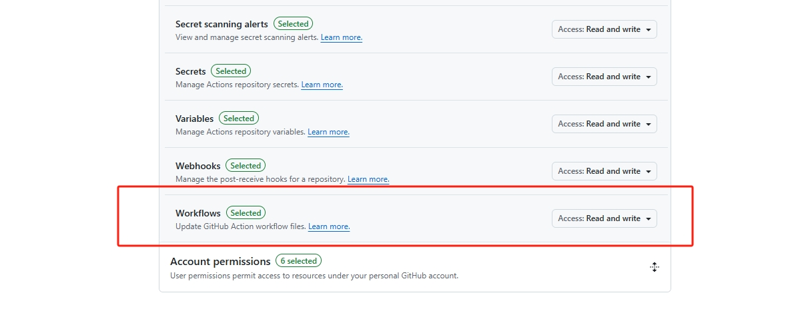
      - 点击Generate token，复制生成的Token
      - 在本地中，使用新Token重新登录（**注意！一定要删除账号重新登录，具体看下面**）

        > 如何在 VSCode 和 Sourcetree 中使用 GitHub PAT？

        **VSCode 使用 PAT**
        1. 当你用 HTTPS 克隆、拉取或推送仓库时，VSCode 会弹出登录窗口。
        2. 选择“使用浏览器登录”或“输入密码”，此时将你的 PAT 粘贴到密码输入框即可（用户名随意填，一般用你的 GitHub 用户名）。
        3. 之后 VSCode 会自动记住你的 Token。

        **Sourcetree 使用 PAT** 4. 打开 Sourcetree，进入“工具”->“选项”->“验证”。5. 找到你的 GitHub 账户，点击“编辑”，选择“HTTPS”方式。6. 下面`验证`选择`Personal Access Token`，点击`刷新Personal Access Token`，将你的 PAT 粘贴到密码输入框确定。**注！！！强烈建议是删除账户重新添加，因为Sourcetree会记住你的Token，删除旧的 GitHub 账户，重新添加时用新的 PAT 作为密码。** 7. 如果是新添加账户，添加时选择 HTTPS，用户名填 GitHub 用户名，密码填 PAT。
        注意 ：PAT 就是密码，千万不要泄露。首次操作后，工具会自动保存，无需每次都输入。

   2. 使用 SSH key 推送 ：
      - 本地生成 SSH 密钥：
        打开终端，输入以下命令：
        `ssh-keygen -t ed25519 -C "替换为你的邮箱"`
        解释一下意思：
        `ssh-keygen`: 是生成 SSH 密钥对的命令
        `-t ed25519`: 指定密钥类型为 ed25519
        一路回车即可，密钥会生成在 ~/.ssh/id_ed25519 和 ~/.ssh/id_ed25519.pub 。
        呃，其实就是C:/用户/用户名/.ssh/id_ed25519 和 C:/用户/用户名/.ssh/id_ed25519.pub。值得注意的是：
        `id_ed25519`: 是私钥文件，不要泄露
        `id_ed25519.pub`: 是公钥文件，需要添加到 GitHub
        注意：如果之前已经生成过 SSH 密钥对，且不想覆盖，可以在生成时指定文件名，例如：
        `ssh-keygen -t ed25519 -C "替换为你的邮箱" -f ~/.ssh/my_ed25519`
        这样会生成在 ~/.ssh/my_ed25519 和 ~/.ssh/my_ed25519.pub 。
        当然，SourceTree 也可以生成 SSH 密钥对， 点击工具里的创建或导入 SSH 密钥对，然后在 SourceTree 中添加即可。
      - 复制公钥：
        打开终端，输入以下命令：
        `cat ~/.ssh/id_ed25519.pub`
        复制输出的内容。
      - 将公钥添加到 GitHub：
        打开 GitHub，进入 Settings -> SSH and GPG keys -> New SSH key。
        标题随便填，Key 内容粘贴 id_ed25519.pub 文件的内容。
        注意：复制公钥时，不要复制注释行，否则会导致 GitHub 无法识别。
      - 配置仓库远程地址为 SSH（命令行）：
        打开终端，进入项目目录，输入以下命令：
        `git remote set-url origin 你的邮箱:用户名/仓库名.git`
        解释一下意思：
        `git remote set-url origin`: 是设置远程仓库地址的命令
        你在某个项目目录下执行 `git remote set-url origin ... `只会修改这个项目的远程仓库地址，不会影响你电脑上的其他项目。如果远程地址是`https://`开头，Git 默认会用 PAT（或密码）认证。如果远程地址是`git@github.com:用户名/仓库名.git`这种 SSH 格式，Git 会用 SSH 密钥认证。推送时用哪种方式 ：取决于你当前项目 remote 的地址格式，和你本地配置的凭据，两者互不影响。
      - 配置仓库远程地址为 SSH（SourceTree）：
        点击`工具`->`选项`->`SSH客户端配置`，选择方式为`OpenSSH`，然后选择之前生成好的SSH 私钥。
      - 测试 SSH 连接：
        打开终端，进入项目目录，输入以下命令：
        `ssh -T git@github.com`
        首次添加时会提示你是否继续连接，输入`yes`即可。
        如果出现类似下面的信息，说明连接成功：
        `Hi 用户名! You've successfully authenticated, but GitHub does not provide shell access.`这个提示只是告诉你：GitHub 不提供命令行 shell 登录服务，但你的密钥认证没问题。现在你可以放心在本地用 SSH 地址操作你的仓库了。
        **需要了解的点**：当你输入`ssh -T git@github.com`时，SSH 默认会在你的用户主目录下的 .ssh 文件夹查找密钥文件（如 Windows 下是`C:\Users\你的用户名\.ssh\`，Linux/Mac 下是`~/.ssh/`）。如果你用默认设置生成密钥，密钥就会放在这个目录下。你也可以通过 SSH 配置文件（`~/.ssh/config`）指定其他密钥路径。如果你手动指定了密钥文件或在配置文件中设置了不同路径，SSH 会优先使用你指定的位置，否则就用默认的 .ssh 目录。
        **如果你想指定 SSH 密钥的位置**，可以通过配置 SSH 的 config 文件来实现。具体做法如下：
        1. 在你的用户主目录下（如 Windows 的 C:\Users\你的用户名.ssh\ 或 Linux/Mac 的 ~/.ssh/）新建或编辑 config 文件。
        2. 在 config 文件中添加如下内容：
        ```
        Host github.com
        HostName github.com
        User git
        IdentityFile C:/你的密钥路径/id_ed25519
        ```
        这样，每次连接 github.com 时，SSH 就会自动使用你指定路径下的私钥文件。这样可以灵活管理多个密钥，也可以让密钥不放在默认位置。

#### 死链接问题

如果你在GitHub自动部署的构建过程中出现类似这样的报错：
`(!) Found dead link ./@ref in file DailyRecord/博客开发记录.md`
那就是因为你的项目中用于构建页面的markdown文件中可能有以下情况：

1.  使用了`@ref`标签，这个标签是VitePress的一个插件，用于在markdown文件中插入链接。但是，在GitHub自动部署的构建过程中，这个插件会被忽略，导致构建失败。
2.  使用了`@`符号，这个符号是VitePress的一个插件，用于在markdown文件中插入链接。但是，在GitHub自动部署的构建过程中，这个插件会被忽略，导致构建失败。
3.  其它情况...
    > 解决方法：
    > 在`config.mjs`中添加忽略死链接的配置，即`ignoreDeadLinks: true，`

- 依然不行？
  1.  检查ignoreDeadLinks 是否写在 defineConfig 的顶层（而不是 themeConfig 内部），并确保语法无误。
  2.  远程环境缓存了旧配置，建议清理缓存或重新安装依赖后再试。
  3.  你的 VitePress 版本过旧，建议升级到最新版（当前1.6.3 已支持 ignoreDeadLinks）。
  4.  检查是否有其它配置文件（如 config.js、config.ts）被误用，确保只有 config.mjs 生效。
  5.  你可以尝试将 ignoreDeadLinks 写成字符串 'true'（即 ignoreDeadLinks: 'true'），有时类型不一致会导致配置未生效。
  6.  呃，你太快了，GitHub Actions 还没部署好或者是自动部署没来得及合并更新，你可以等一会再试。(我出现过放着不管第二天自动部署好了的情况)

#### pnpm依赖缓存问题

> 解决方法:
> 在`workflow`配置文件中添加 pnpm store prune 清理缓存步骤，这有助于避免依赖缓存问题：

```
- name: Clean pnpm cache
  run: pnpm store prune
```

#### CSS样式不生效

> 解决方法:
> 在项目目录下手动创建`.nojekyll`文件。
> 在`config.mjs`的`defineConfig`里的顶部添加配置：`base: '/项目名/'`，项目名就是你的仓库名。
> 注意啊，像head的链接还需要手动在原来的href路径前添加`/项目名/`。类似：`/doc-demo/logo.svg`
